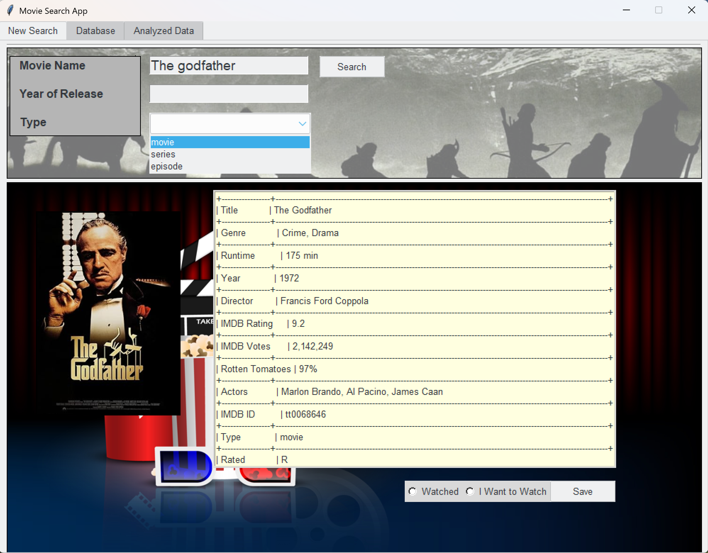
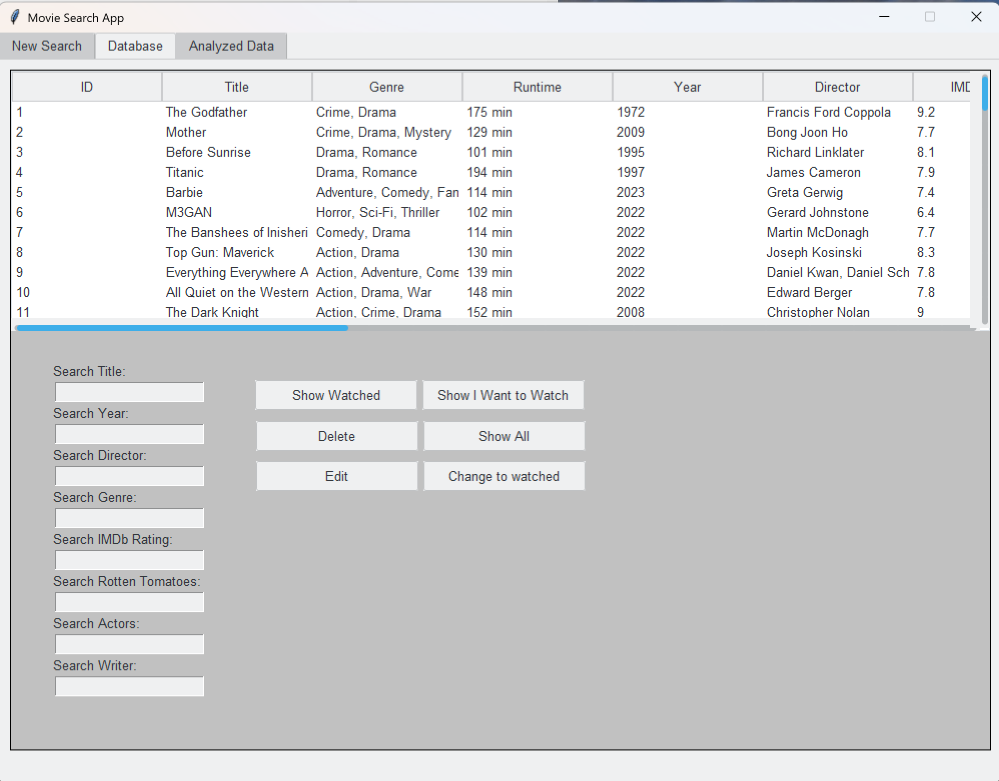
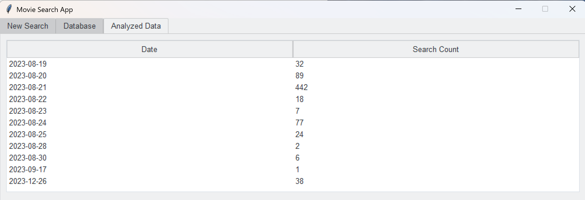

# Movie Library Desktop Application

A complete desktop application to manage your movie collection, allowing you to track movies you have watched and those you want to watch. This project has been converted into an installable software with an MSI setup.

## Search Tab Overview:
- Search functionality based on movie/series/episode name, type, and production year.
- Retrieval of rich metadata from an external API for accurate and up-to-date details.
- Ability to categorize movies as "watched" or "want to watch" and save these choices to the local database.
- User-friendly interface with multiple tabs to manage and explore your movie collection efficiently.



---

## Database Tab Overview
The second tab provides comprehensive management of the movie database, including detailed information about each movie and whether it has been watched or not.


**Features include:**
- Viewing and editing complete movie details.
- Searching the database using multiple filters such as director, actors, release year, genre, movie rating, and writer.
- Full editing capabilities to update the movie database records.
- This tab is designed to give users full control over their movie collection data, making it easy to organize and find movies based on various attributes.

---
## Third Tab: Database Change Log and Future Enhancements
The third tab currently displays the log of changes made to the movie database, helping users track all modifications during usage. This feature is still under active development.

**Future planned enhancements include:**
- Adding detailed analysis of the database content.
- Incorporating favorite movies tracking.
- Showing watched genres statistics.
- Integrating various interactive charts and visualizations to provide deeper insights into your movie collection.

Stay tuned for updates as these features are being implemented!
---

## Overall Features

- Add, edit, and delete movies in your library.
- Categorize movies as watched or want to watch.
- Analyze and visualize your movie data.
- User-friendly graphical interface.

## Files Overview

- **New_edit.py**  
  The main application script that launches the GUI for managing the movie library. This script contains the full functionality of adding, editing, and viewing movies along with saving data to CSV files.

- **msi_setup.py**  
  The setup script used to build an MSI installer for Windows. It packages the application into an executable and creates an easy-to-use Windows installer, enabling simple installation on any compatible system.

## Installation and Usage

### Prerequisites

- Python 3.8 or higher installed on your system.
- Required Python packages installed via:

  ```bash
  pip install -r requirements.txt

Running the Application
To launch the application directly without installation, run:

```bash
python New_edit.py
```

Creating the MSI Installer
To create a Windows installer package (MSI file), run:

```bash
python msi_setup.py
```
This will generate an MSI installer in the build folder. Use this installer to install the Movie Library application on Windows systems easily.

---
### Requirements
The project depends on the following Python packages:

```bash
requests
pillow
tabulate
ttkthemes
```
---
## Project Structure

```bash
movie-Library/
│
├── New_edit.py         # Main GUI application script
├── msi_setup.py        # MSI build and setup script
├── requirements.txt    # Required Python packages
├── movie_results.csv   # Data file for movie entries
├── watched_movies.csv  # Data file for watched movies
├── want_to_watch_movies.csv  # Data file for movies planned to watch
├── analyze.csv         # Data file for movie analysis
├── cinema5.jpg         # Background or UI image asset
└── header.jpg          # Header image asset

```
---
### Notes

- The application saves data in CSV files located in the project directory.
- Ensure that all dependencies are installed before running or packaging.
- The MSI installer is built using cx_Freeze and WiX Toolset. Make sure you have WiX installed and properly configured for MSI creation.
---
### Support
For any issues or feature requests, please open an issue on the GitHub repository.
---
## Author

This Movie Library application was developed by *Navid TK.*, combining my passion for movies and programming.  
If you have any questions, suggestions, or want to collaborate, feel free to reach out!

---

Thanks for checking out my project!
